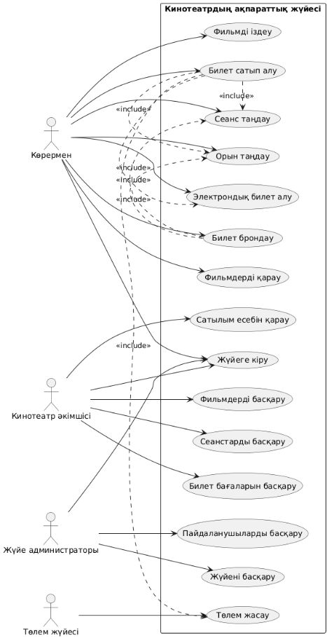
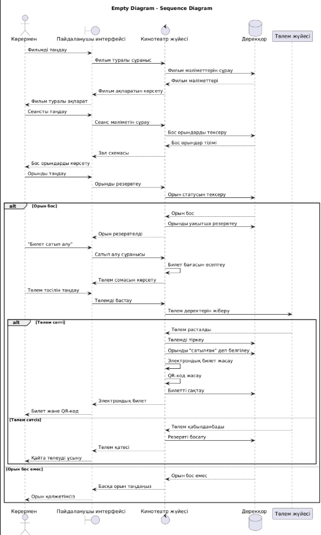
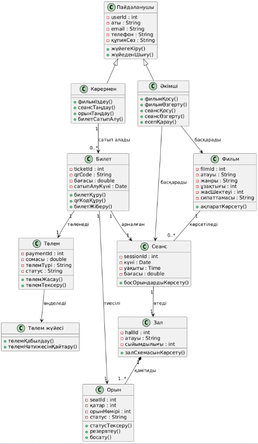
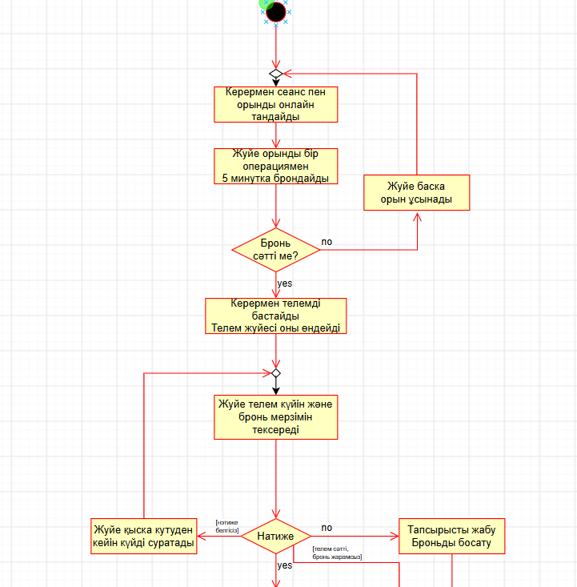

# Кинотеатрдың ақпараттық жүйесі: User Story және Use Case

Бұл құжат №3 зертханалық жұмыста қалыптастырылған талаптар мен сценарийлерге сүйенеді. Негізгі бизнес-процесс — **фильм, сеанс және орын таңдау, билет сатып алу және төлем жасау**.

## 1. Жүйеге қатысушылар (Actor)

| Actor | Жүйедегі әрекеттері |
|---|---|
| **Көрермен** | Жүйеге кіреді; фильм іздейді; сеанс пен орын таңдайды; билетті брондайды немесе сатып алады; электрондық билет алады |
| **Кассир** | Билет сату мен рәсімдеуге қатысады, төлем қабылдайды |
| **Кинотеатр әкімшісі** | Жүйеге кіреді; фильмдер, сеанстар, залдар мен бағаларды басқарады; сатылым есебін қарайды |
| **Жүйе администраторы** | Пайдаланушылар мен техникалық параметрлерді басқарады |
| **Сыртқы төлем жүйесі** | Онлайн төлемді өңдеп, нәтижесін кинотеатр жүйесіне қайтарады |

## 2. User Story

**US-01.** Мен көрермен ретінде фильмді атауы немесе жанры бойынша іздегім келеді, себебі қажетті фильмді жылдам тапқым келеді.

**US-02.** Мен көрермен ретінде таңдалған фильмнің қолжетімді сеанстарын көргім келеді, себебі өзіме ыңғайлы уақытты таңдағым келеді.

**US-03.** Мен көрермен ретінде зал схемасынан бос орындарды көріп, қажетті орынды таңдағым келеді, себебі фильмді өзіме ыңғайлы орында көргім келеді.

**US-04.** Мен көрермен ретінде таңдалған билет үшін онлайн төлем жасағым келеді, себебі кассаға бармай-ақ билетті алдын ала сатып алғым келеді.

**US-05.** Мен көрермен ретінде төлемнен кейін электрондық билет пен QR-код алғым келеді, себебі кинотеатрға кірген кезде билетімді телефоннан көрсеткім келеді.

**US-06.** Мен кинотеатр әкімшісі ретінде жаңа сеанс қосып, оның уақытын өзгерте немесе жоя алғым келеді, себебі кинотеатр репертуарын тиімді басқаруым қажет.

**US-07.** Мен кинотеатр әкімшісі ретінде сатылған билеттер мен кіріс туралы есепті көргім келеді, себебі кинотеатр жұмысының нәтижесін талдауым қажет.

## 3. Use Case тізімі

| Код | Use Case | Actor |
|---|---|---|
| UC-01 | Жүйеге кіру | Көрермен, кинотеатр әкімшісі |
| UC-02 | Фильм, сеанс және орын таңдау | Көрермен |
| UC-03 | Билет сатып алу және төлем жасау | Көрермен, сыртқы төлем жүйесі |
| UC-04 | Сеанстарды басқару | Кинотеатр әкімшісі |
| UC-05 | Сатылым туралы есепті қарау | Кинотеатр әкімшісі |

## 4. UC-01 — Жүйеге кіру

**Actor:** Көрермен / кинотеатр әкімшісі.

**Мақсаты:** пайдаланушының жеке аккаунты арқылы жүйеге кіруін қамтамасыз ету.

**Бастапқы шарт:** пайдаланушы жүйеде тіркелген болуы тиіс.

**Негізгі сценарий:**
1. Пайдаланушы кинотеатрдың веб-сайтын немесе мобильді қосымшасын ашады.
2. «Кіру» батырмасын басады.
3. Жүйе логин мен құпия сөзді енгізу формасын көрсетеді.
4. Пайдаланушы деректерін енгізеді.
5. Жүйе логин мен құпия сөзді тексереді.
6. Деректер дұрыс болса, жүйе пайдаланушыны авторизациялайды.
7. Пайдаланушы жеке кабинетіне кіреді.

**Баламалы сценарий:** логин немесе құпия сөз қате болса, жүйе қате хабарламасын көрсетіп, қайта енгізуді ұсынады.

**Нәтиже:** пайдаланушы жүйеге кіреді және өз рөліне сәйкес функцияларды қолдана алады.

## 5. UC-02 — Фильм, сеанс және орын таңдау

**Actor:** Көрермен.

**Мақсаты:** қажетті фильмді, көрсетілім уақытын және залдағы орынды таңдау.

**Бастапқы шарт:** жүйеде фильмдер мен сеанстар туралы мәліметтер енгізілген.

**Негізгі сценарий:**
1. Көрермен фильмдер тізімін ашады.
2. Жүйе қолжетімді фильмдерді көрсетеді.
3. Көрермен фильмді таңдайды.
4. Жүйе фильм туралы толық ақпаратты көрсетеді.
5. Жүйе қолжетімді сеанстарды көрсетеді.
6. Көрермен қажетті сеансты таңдайды.
7. Жүйе зал схемасын және бос/бос емес орындарды көрсетеді.
8. Көрермен қажетті орынды таңдайды.
9. Жүйе орынның бос екенін тексереді.
10. Орын бос болса, жүйе оны уақытша резервке қояды.
11. Жүйе билет бағасын есептеп көрсетеді.

**Баламалы сценарий:** орын бұрын сатылып кеткен болса, жүйе оның қолжетімсіз екенін хабарлап, басқа бос орынды таңдауды ұсынады.

**Нәтиже:** фильм, сеанс және орын таңдалып, орын уақытша резервке қойылады.

## 6. UC-03 — Билет сатып алу және төлем жасау

**Actor:** Көрермен; қосымша Actor — сыртқы төлем жүйесі.

**Мақсаты:** таңдалған билет үшін төлем жасап, электрондық билет алу.

**Бастапқы шарт:** көрермен фильмді, сеансты және бос орынды таңдаған болуы тиіс.

**Негізгі сценарий:**
1. Көрермен «Билет сатып алу» батырмасын басады.
2. Жүйе билет туралы ақпаратты көрсетеді.
3. Жүйе билет құнын автоматты түрде есептейді.
4. Көрермен төлем тәсілін таңдайды.
5. Жүйе төлем мәліметтерін сыртқы төлем жүйесіне жібереді.
6. Төлем жүйесі деректерді өңдейді.
7. Төлем жүйесі кинотеатр жүйесіне төлем нәтижесін қайтарады.
8. Төлем сәтті болса, кинотеатр жүйесі оны тіркейді.
9. Таңдалған орын «сатылған» деп белгіленеді.
10. Жүйе бірегей электрондық билет пен QR-код қалыптастырады.
11. Жүйе билетті жеке кабинетке, электрондық поштаға немесе телефонға жібереді.

**Баламалы сценарий:** төлем сәтсіз болса, жүйе «Төлем орындалмады» хабарламасын көрсетеді және қайта төлеуді ұсынады; сатып алу тоқтатылса, уақытша резервтелген орын босатылады.

**Нәтиже:** төлем сәтті орындалған жағдайда билет дерекқорға тіркеледі, орын сатылған деп белгіленеді және пайдаланушы электрондық билет алады.

## 7. UC-04 — Сеанстарды басқару

**Actor:** Кинотеатр әкімшісі.

**Мақсаты:** кинотеатр репертуарындағы сеанстарды басқару.

**Негізгі мүмкіндіктері:** жаңа сеанс қосу, сеанс уақытын өзгерту және қажет болса жою. Бұл сценарийдің атауы мен мүмкіндіктері №3 зертханалық жұмыста берілген; егжей-тегжейлі қадамдық сценарийі сол құжатта жеке ашылмаған.

## 8. UC-05 — Сатылым туралы есепті қарау

**Actor:** Кинотеатр әкімшісі.

**Мақсаты:** кинотеатр жұмысының нәтижесін талдау.

**Негізгі мүмкіндіктері:** сатылған билеттер саны мен кіріс бойынша статистикалық есепті қарау, сондай-ақ фильмдер мен сеанстар бойынша нәтижелерді талдау. Бұл сценарий №3 зертханалық жұмыста тізімделген, бірақ жеке толық қадамдық сценарий ретінде сипатталмаған.

## 9. Use Case пен UML диаграммаларының байланысы

| Пайдаланушы әрекеті | Диаграммадағы көрінісі |
|---|---|
| Фильмдерді қарау және іздеу | Use Case: көрерменнің функциялары |
| Сеанс және орын таңдау | Use Case және Sequence: таңдау, бос орынды тексеру |
| Билет сатып алу | Sequence: сатып алу сұранысы |
| Төлем жасау | Sequence: сыртқы төлем жүйесімен әрекеттесу |
| Электрондық билет алу | Sequence: билет пен QR-кодты қалыптастыру |
| Фильмдер мен сеанстарды басқару | Use Case: әкімшінің функциялары |

## 10. Диаграммалар

### Use Case Diagram

[PlantUML коды](diagrams/use-case.puml)

### Sequence Diagram — билет сатып алу және төлем жасау

[PlantUML коды](diagrams/sequence-diagram.puml)

### Class Diagram — жүйенің негізгі объектілері

[PlantUML коды](diagrams/class-diagram.puml)

### Activity Diagram — әрекеттердің орындалуы

## Қорытынды

Use Case сценарийлері көрермен мен кинотеатр әкімшісінің ақпараттық жүйемен өзара әрекеттесуін сипаттайды. Негізгі бизнес-процесс фильмді, сеансты және орынды таңдаудан басталып, төлем жасалып, электрондық билет берілгенге дейін жалғасады. UML диаграммалары бұл сценарийлердің функцияларын, орындалу ретін және жүйенің құрылымын өзара толықтырып көрсетеді.
